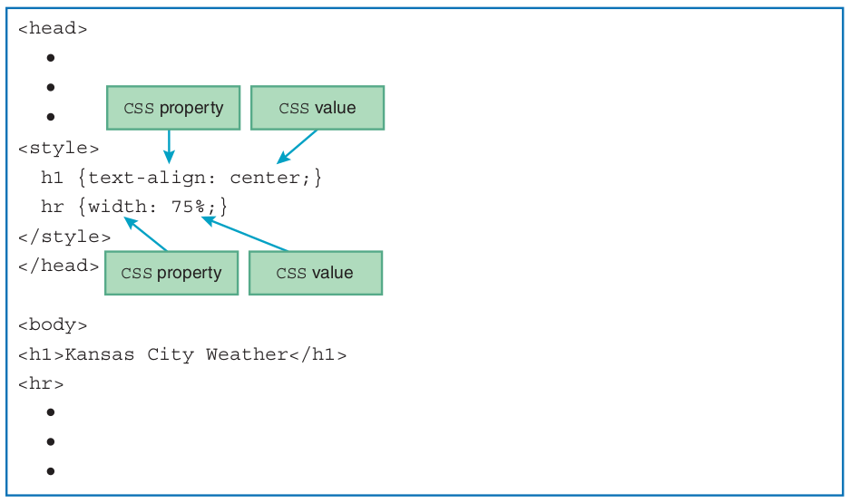
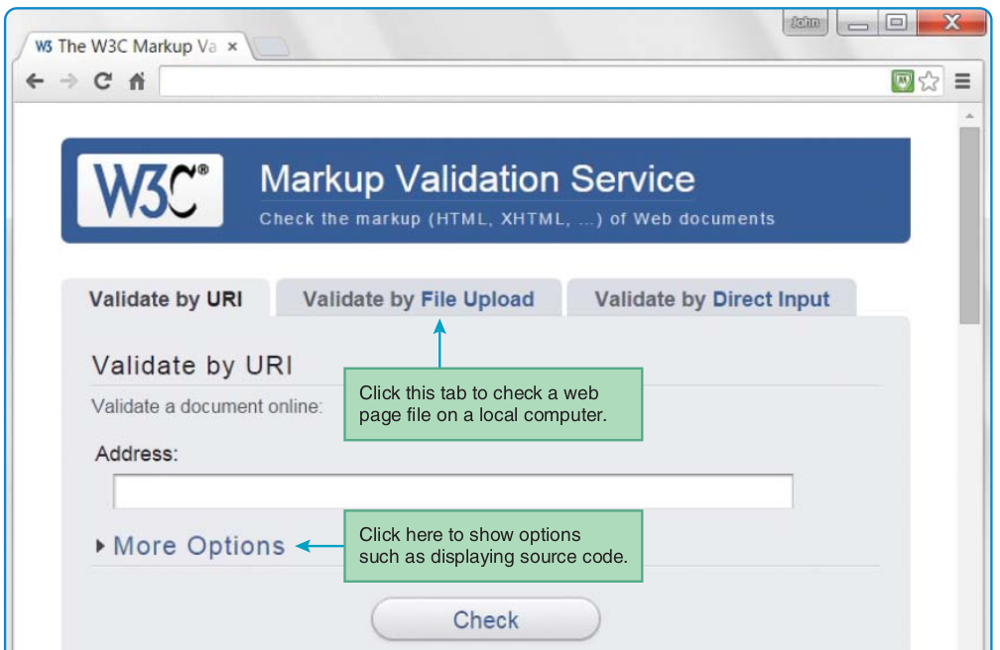

# بسم الله الرحمن الرحيم

## Typical Website

- A website is a collection of related web pages that are normally stored on a single web server computer.
- A web server is a computer system that enables users to access web pages stored on the web server’s computer. The term “web server” can refer to the web page-accessing software that runs on the computer, or it can refer to the computer itself.


## Creating Website

To create a website, you’ll need these things:

1. a text editor
2. an upload/publishing tool
3. a web hosting service
4. a browser

- Website File Processing


- Webpage Example


- Demo-01.html
  - view source

- HTML Skeleton Code

```html
<!DOCTYPE html>
<html lang="en">
<head>
.
.
.
</head>
<body>
.
.
.
</body>
</html>
```

- HEAD Container

```html
<head>
<meta charset="utf-8">
<meta name="author" content="John Dean">
<meta name="description" content="Kansas city weather conditions">
<title>K.C. Weather</title>
</head>
```

- BODY Container

```html
<body>
<h1>Kansas City Weather</h1>
<hr>
<p>
It should be pleasant today with a high of 95 degrees.<br>
With a humidity reading of 30%, it should feel like 102 degrees.
</p>
<div>
Tomorrow's temperatures:<br>
high 96, low 65
</div>
</body>
```

- CSS Preview


## HTML Versions

The following differences address the issue of existing web pages that don’t match XHTML 1.0’s strict syntax. More specifically, the following differences show how HTML5 has loosened up some of its syntax rules as compared to XHTML 1.0:
- With HTML5, there’s no longer a requirement to have a quoted value for every attribute. So for some HTML5 attributes, it’s legal to include an attribute by itself, without an equals sign or value attached to it. However, standard coding conventions suggest always including the quotation marks.
- With HTML5, there’s no longer a requirement to have a / for all void elements.
For example, the XHTML specification requires writing the br void element with a slash, `<br/>`. The HTML5 specification says you can include or omit the slash. Standard coding conventions suggest always omitting the / .
With HTML5, there’s no longer a requirement to have an end tag for every container.
- The XHTML specification requires including a `</p>` end tag for every p container element. The HTML5 specification says you can include or omit the end tag. Standard coding conventions suggest always including the end tag.

The HTML5 standard includes quite a few new constructs. The following list shows just some of them:
- Structural organization elements — Two examples are the header and footer elements.
- Audio and video — The audio and video elements allow users to play music and video files directly from their browsers without the need of a plug-in.
- Canvas — The canvas element provides a drawing area and a set of commands that a web programmer can use to draw two-dimensional shapes and animate them.
- Drag and drop functionality — The drag and drop constructs provide the ability to drag elements within a web page.
- Web storage functionality — The web storage constructs provide the ability to permanently store data on the browser’s computer.
- Geolocation functionality—The geolocation constructs provide the ability to locate the browser’s computer.

## Check Validity

- WHATWG’s HTML standard for web developers (with browser manufacturer details removed) - <https://developers.whatwg.org>
- A subset of the WHATWG’s standard. It describes all the HTML5 elements - <https://html.spec.whatwg.org/multipage/semantics.html>

W3C’s HTML validation service


- Demo
  - Save the following syntax in an html fle
  - validate it using W3C HTML Validation Service

```html
<!DOCTYPE html>
<html lang="en">
<head>
<meta charset="utf-8">
<title>K.C. Weather<title>
</head>
<body>
<h1>Kansas City Weather</h1>
<hr>
<p>
It should be pleasant today with a high of 95 degrees.<br>
With a humidity reading of 30%, it should feel like 102 degrees.
<div>
</p>
Tomorrow's temperatures:<br>
high 96, low 65
</div>
</body>
</html>
```

## Lab-01