# بسم الله الرحمن الرحيم

## Cascading Style Sheets (CSS)

The W3C’s philosophy in terms of how HTML and CSS should fit together is
1. use HTML elements to specify a web page’s content
2. use CSS to specify a web page’s appearance.

There are lots and lots of CSS properties that enable you to determine a web page’s appearance.

## CSS Rules

The way CSS works is that CSS rules are applied to elements within a web page. Browsers determine which elements to apply the CSS rules to with the help of selectors.

- Selectors
`hr {width: 50%;}`

- wildcards
`* {text-align: center;}`

### Example

In the next figure, three CSS rules, notice the four property-value pairs inside the {} ’s, and copied here for your convenience:
- text-align: center
- width: 50%
- font-style: italic
- color: blue

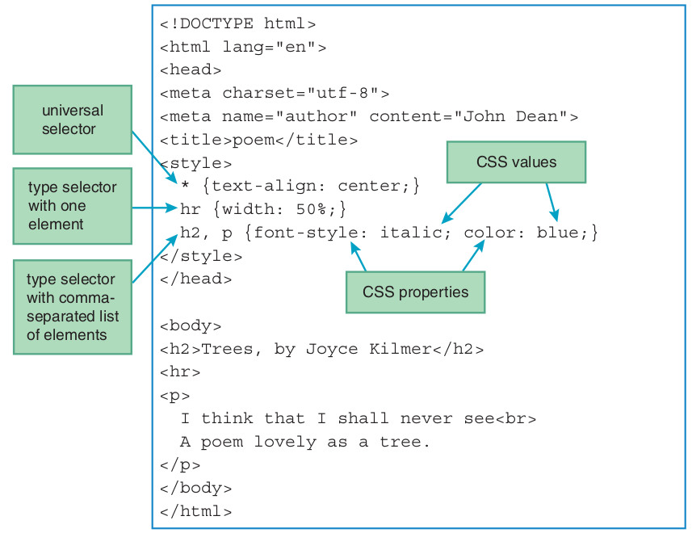

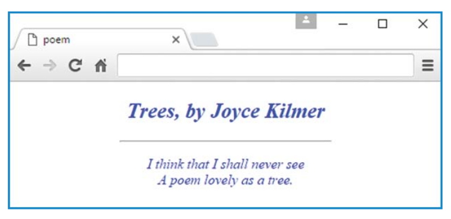

## CSS Syntax and Style


## Class Selectors


The dot thing ( .red in this example) is called a class selector because its purpose is to select elements that have a particular value for their class attribute. So the class selector rule would select/match the following element because it has a class attribute with a value of red :
```html
<q class="red">It is better to keep your mouth closed and let people
think you are a fool than to open it and remove all doubt.</q>
```

```css
.red, .conspicuous, h1 {background-color: tomato;}
```


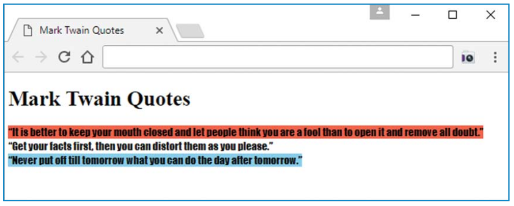

### Class Selector with Element Type Prefix

```css
element-type.class-value {property1: value; property2: value;}
```
And here’s an example CSS rule that uses a class selector with an element type prefix:
```css
q.blue {background-color: skyblue;}
```


### Class Selectors with * Prefixes

Because * is the universal selector, it matches all elements. Therefore, the following CSS rule is equivalent to a standard class selector rule (with no prefix):

```css
*.class-value {property1: value; property2: value;}
```

So what would the following CSS rule do?

```css
*.big-warning {font-size: x-large; color: red;}
```

It would match all elements in the web page that have a class attribute value of big-warning , and it would display those elements with extra-large red font.

## ID Selectors

An ID selector is similar to a class selector in that it relies on an element attribute value in searching for element matches.

```css
<h3 id="lizards-lounge">Lizards Lounge</h3>
```


```css
#lizards-lounge {color: green;}
```

## span and div Elements

```css
<span class="white aorange-background">$10</span>
```


## Cascading


## `style` attribute and `style` container

```css
<h2 style="text-decoration:underline;">Welcome!</h2>
```

## External CSS Files

```css
<link rel="stylesheet" href="name-of-external-file">
```


## CSS Validation Service

<https://jigsaw.w3.org/css-validator>

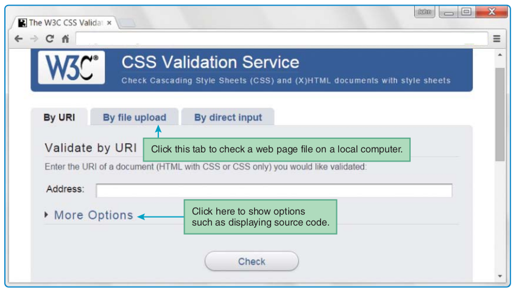

## CSS Properties

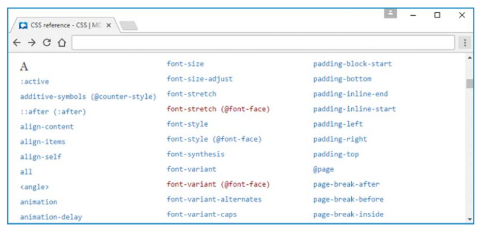


### Color Properties


```css
<style>
.eggplant {background-color: rgb(52%,20%,45%);}
</style>
```

```css
.black {background-color: rgb(0%,0%,0%);}
```

```css
.white {color: rgb(100%,100%,100%);}
```

```css
<style>
.favorite1 {color: rgb(144,238,144);}
.favorite2 {color: rgb(127,127,127);}
</style>
```

```css
<style>
.sapphire {background-color: #0f42ba;}
</style>
```

### Opacity

```css
rgba(red-integer,green-integer,blue-integer,opacity-number-between-0-and-1)
rgba(red-percent,green-percent,blue-percent,opacity-number-between-0-and-1)
```
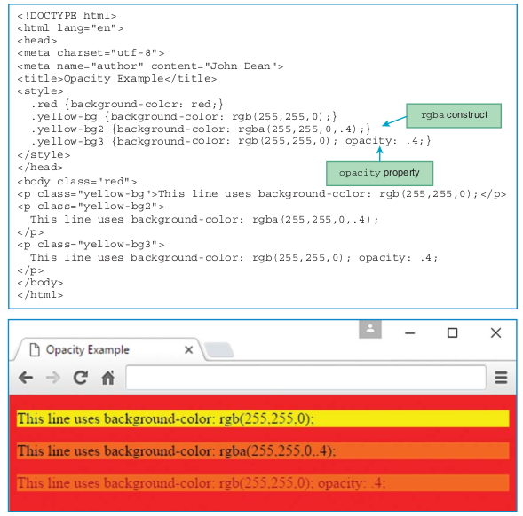

```css
.yellow-bg {background-color: rgb(255,255,0);}
```

```css
.yellow-bg2 {background-color: rgba(255,255,0,.4);}
```

```css
.yellow-bg3 {background-color: rgb(255,255,0); opacity: .4;}
```

```css
hsl(hue-integer,saturation-percent,lightness-percent)
```

```css
<style>
p {background-color: hsl(120,50%,75%);}
</style>
```
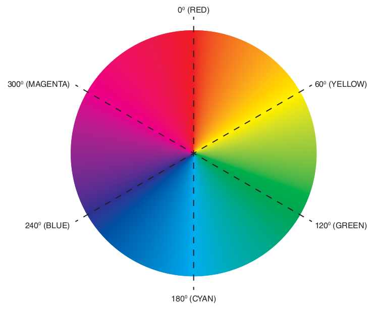

```css
<style>
.background {background-color: hsla(120,50%,75%,.5);}
</style>
```


```css
.italics {font-style: italic;}
```
### `font-variant` Property


### `font-weight` Property

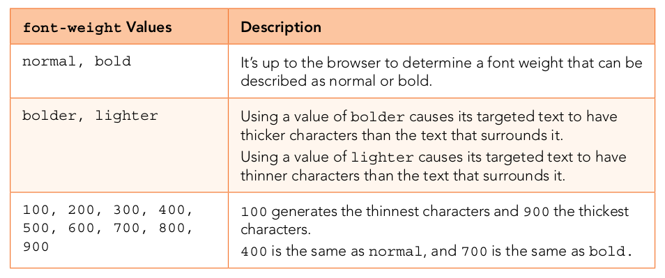

### `font-size` Property

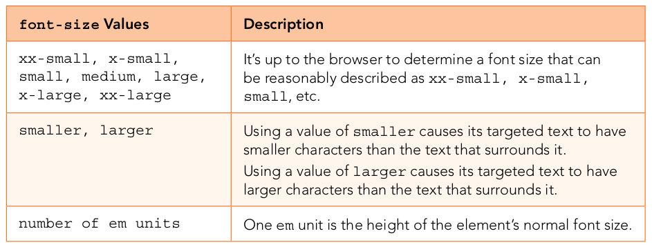

```css
.huge-font {font-size: xx-large;}
```

```css
.disclaimer {font-size: .5em;}
.advertisement {font-size: 3em;}
```

### `font-family` Property

```css
.ascii-art {font-family: Courier, Prestige, monospace;}
```


```css
font: [font-style-value] [font-variant-value] [font-weight-value]
font-size-value[/line-height-value] font-family-value
```


### `line-height` Property

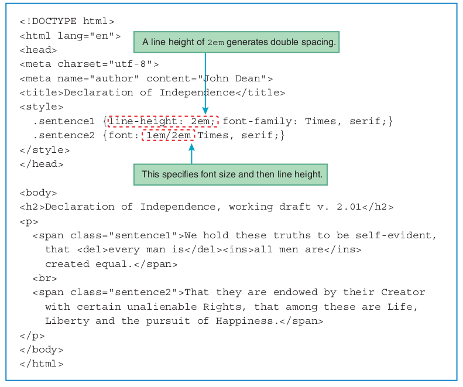

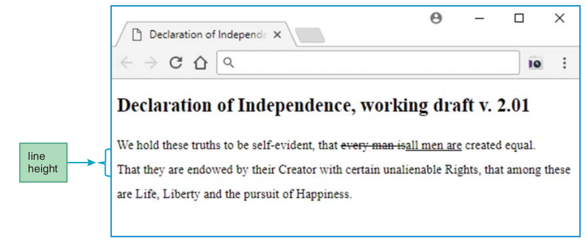

```css
.proof-reading {line-height: 300%;}
```

## Text Properties

### `text-align` Property


### `text-decoration` Property

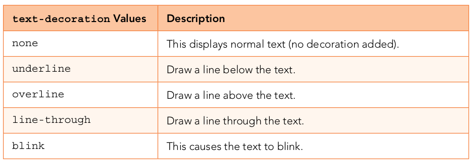

```css
.underlined {text-decoration: underline;}
```

### `text-transform` Property


### `text-indent` Property

```css
p {text-indent: 4em;}
```

## Border Properties

### `border-style` Property

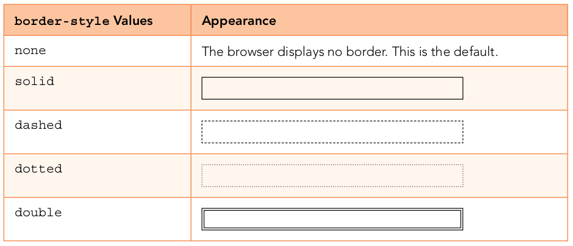

```css
.coupon {border-style: dashed;}
```

### `border-width` Property


```css
.boxed {
border-style: solid;
border-width: 4px 2px 0px 2px;
}
```

```html
My idol is <span class="boxed">Tim Berners-Lee</span>. He rocks!
```


### `border` shorthand Property

```css
.understated-box {border: thin dotted blue;}
.in-your-face-box {border: 10px solid;}
```

## Element Box, padding Property, margin Property

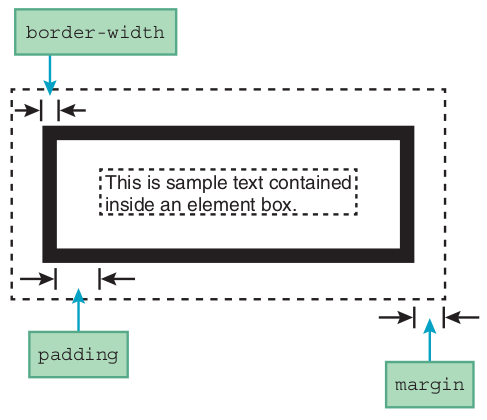

```css
.label {border: solid; padding: 20px; margin: 20px;}
```

```css
.label {
padding: 20px;
margin: 20px;
display: inline-block;
}
```

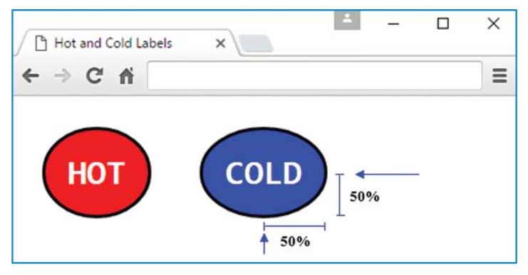

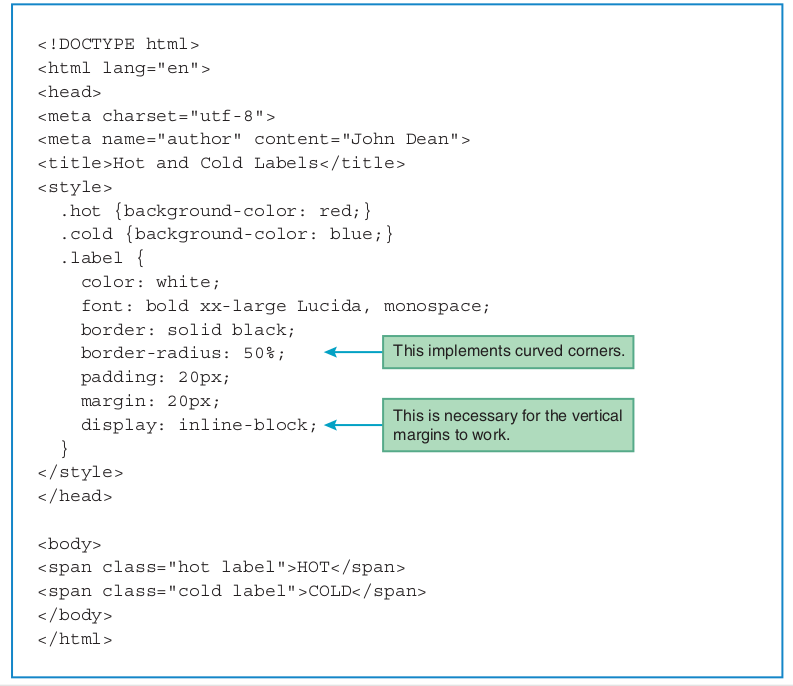

```css
body {margin: 10%;}
```

### When to Use the Different Length Units

- Use `em` for font-related properties (like font-size ).
- Use `px` for properties that should be fixed for a given resolution, even if the element’s font size changes or even if the containing element’s size changes. Typically, that means using `px` for things like border properties and layout.
- Use `%` for properties that should grow and shrink with the size of the containing element (like margins for the body element).
- Use absolute units sparingly—only when a fixed size is essential and the target device has a high resolution.

## Lab
